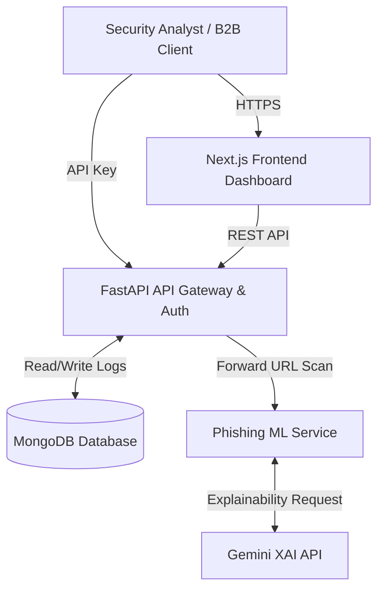
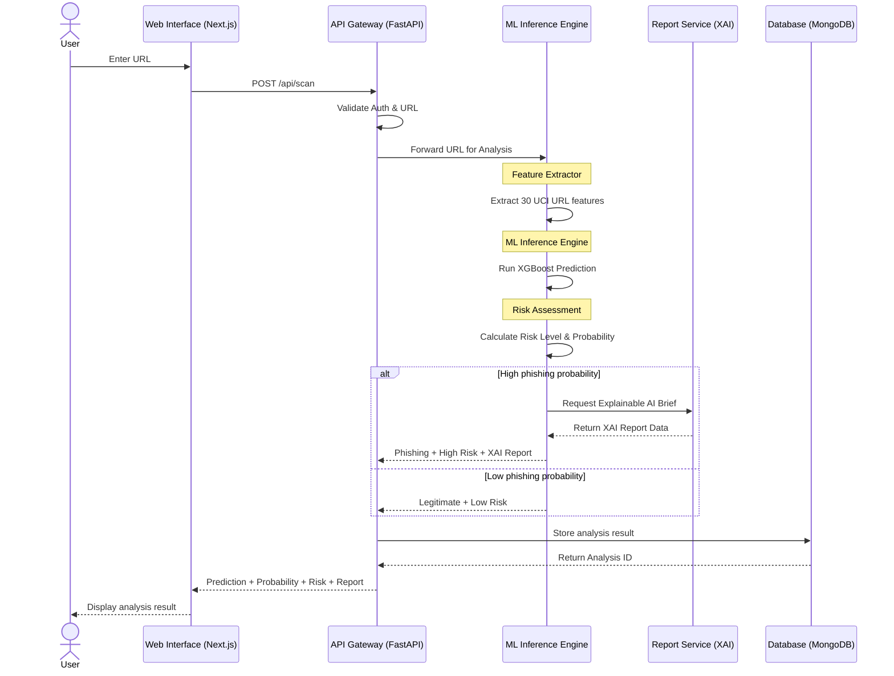

# OmniShield System Architecture & Flowchart

Here are the system architecture and flowchart details you can use for your PowerPoint presentation.

## 1. High-Level System Architecture

**Core Components:**
*   **Frontend (Command Center):** Built with Next.js (React) and Tailwind CSS. Provides a unified dashboard for security analysts to monitor threats, view XAI intelligence briefs, and analyze B2B telemetry.
*   **API Gateway (FastAPI):** The central hub that routes incoming requests, handles user authentication (JWT), manages API keys, and logs telemetry/threat data into MongoDB.
*   **Microservices Layer:**
    *   **Phishing Detection Service:** Uses Machine Learning (XGBoost) to evaluate URL features. It also integrates with the Gemini API to provide Explainable AI (XAI) insights.
    *   **Deepfake Detection Service:** (Extensible architecture designed to accommodate multimedia threat scanning).
*   **Database:** MongoDB stores user profiles, active API keys, and historical threat logs for analytics.
*   **Containerization:** The entire backend ecosystem is orchestrated using Docker and Docker Compose.

### Architecture Diagram (Mermaid)

---

## 2. Complete System Algorithm Flowchart

This flowchart outlines the complete algorithmic flow of the system, covering both UI scans and B2B telemetry ingestion.

### Complete Algorithm Flowchart (Mermaid)

```mermaid
flowchart LR
    Start([Incoming Request]) --> Auth{Authenticate Request}
    
    Auth -->|JWT Token| GatewayUI[API Gateway - UI Request]
    Auth -->|API Key| GatewayB2B[API Gateway - External B2B Request]
    Auth -->|Invalid Auth| Reject[Reject Request]
    
    %% B2B Telemetry Flow
    GatewayB2B --> TelemetryCheck{Is it Telemetry Data?}
    TelemetryCheck -->|Yes| AnalyzeTelemetry[Analyze Request Rate, Payload Size, Indicators]
    AnalyzeTelemetry --> CalcRiskB2B[Calculate Telemetry Risk Score]
    CalcRiskB2B --> LogThreatB2B[Log Threat to MongoDB with Metadata]
    LogThreatB2B --> ReturnB2B[Return Status to B2B Client]
    
    %% Phishing URL Scan Flow
    GatewayUI --> IsURLScan{Is it a URL Scan?}
    TelemetryCheck -->|No, it is a URL Scan| IsURLScan
    
    IsURLScan -->|Yes| PhishingService[Forward to Phishing ML Service]
    PhishingService --> ExtractFeatures[Extract 30 UCI Features from URL]
    ExtractFeatures --> MLPredict{XGBoost Model Prediction}
    
    MLPredict -->|Risk > Threshold| IsPhishing[Flagged as CRITICAL THREAT]
    MLPredict -->|Risk <= Threshold| IsSafe[Flagged as SAFE]
    
    IsPhishing --> GeminiAPI[Request Gemini API for XAI Explanation]
    GeminiAPI --> CombineData[Combine Prediction, Risk Score, and XAI Brief]
    
    IsSafe --> CombineDataSafe[Combine Prediction and Risk Score]
    
    CombineData --> LogThreatUI[Save Threat Log to MongoDB]
    CombineDataSafe --> LogThreatUI
    
    LogThreatUI --> ReturnUI[Return Results to Dashboard]
    
    ReturnB2B --> End([Process Complete])
    ReturnUI --> End
```

### Presentation Tips:
*   **For the Architecture:** Emphasize the modularity of the system. The API gateway cleanly separates the Next.js frontend from the heavy ML microservices.
*   **For the Flowchart:** Highlight the **Explainable AI (XAI)** step. This is a unique selling point that bridges the gap between raw ML predictions and human readability.

---

## 3. OmniShield Sequence Diagram

This sequence diagram illustrates the exact order of interactions across the system components when a user analyzes a URL, mimicking the layout and flow you requested.

### Sequence Diagram (Mermaid)

